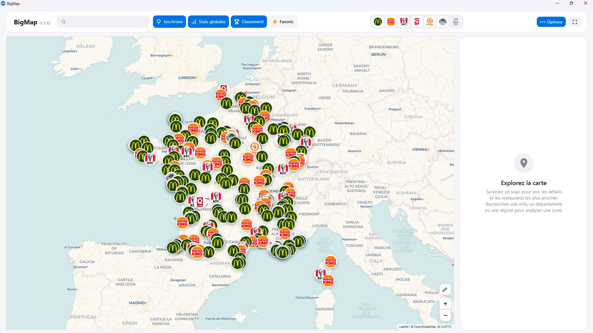

**L'outil de géomarketing du marché français du fast-food.**
Savoir où sont les enseignes, ce qu'elles réalisent, et où il reste de la place.

---

## Pourquoi BigMap

Avant de choisir une ville ou un emplacement, il faut savoir où sont les concurrents,
combien ils réalisent, et où aucune enseigne n'est encore implantée.

BigMap rassemble ces informations sur **une seule carte interactive** : décider sur des
données réelles plutôt que sur l'intuition.

> **Chiffres bruts, zéro parti pris.** BigMap n'attribue aucun score et ne recommande
> aucun emplacement : l'application affiche ce que disent les sources officielles et
> laisse l'analyse à celui qui la lit. Quand une donnée n'existe pas, elle reste vide.

---

## Ce que contient la base

| | |
|---|---|
| **3 197** restaurants actifs | McDonald's, Burger King, KFC, Quick, Popeyes, O'Tacos |
| **377** Quick historiques | emplacements d'avant la reprise par Burger King (2013) |
| **90 %** positionnés précisément | au bâtiment, au numéro de rue ou par accrochage |
| **99,8 %** avec revenu médian | source INSEE Filosofi |
| **100 %** avec population et densité | source INSEE |
| **88 %** avec date d'ouverture | source SIRENE |

Répartition : McDonald's 1 630 · Burger King 615 · KFC 396 · O'Tacos 339 ·
Quick 186 · Popeyes 26.

---

## Fonctionnalités

### Carte et concurrence
Tous les restaurants géolocalisés, filtrables par enseigne d'un simple clic. Fond de
carte embarqué : l'application s'ouvre instantanément, pour un affichage rapide et fluide.

### Chiffres d'affaires
CA annuels 2021-2025 et variation d'une année sur l'autre, avec le nombre de commandes
et le ticket moyen là où la donnée existe.

### Zones de chalandise
Isochrones routières de 5 à 45 minutes autour d'un point : population estimée de la zone,
nombre de concurrents et CA cumulé, enseigne par enseigne.

### Analyse par territoire
Recherche d'une ville, d'un département ou d'une région. Une ville affiche toute son
intercommunalité — communes membres, population, densité, restaurants de la zone — plus
un classement Top 100 par CA et les parts de marché par enseigne.

### Données de la commune
Population, densité et revenu médian par habitant sur chaque fiche restaurant.

### Annotation de la carte
Barre d'outils façon Paint : pinceau, ligne, flèche, rectangle, cercle et gomme, en six
couleurs. Les tracés restent accrochés au terrain quand on déplace ou zoome la carte.

### Notes et favoris
Une note libre par restaurant, enregistrée automatiquement, et une liste de favoris. Les
deux survivent aux mises à jour de données.

### Vue rue et repositionnement
Lien direct vers la vue rue. Une position imprécise peut être corrigée à la main, et la
correction annulée à tout moment.

---

## Aperçu

*La carte interactive : toutes les enseignes géolocalisées, filtrables d'un clic.*

---

## Sources de données

Toutes les données proviennent de sources **officielles et publiques** :

| Source | Usage |
|---|---|
| **INSEE Filosofi** | revenu médian par commune |
| **INSEE SIRENE** | dates d'ouverture, référentiel des établissements |
| **Base Adresse Nationale** | géocodage |
| **geo.api.gouv.fr** | communes, intercommunalités, contours |
| **OpenStreetMap** | positionnement au bâtiment |
| **OpenRouteService** | isochrones routières (zones de chalandise) |
| **CARTO / Leaflet** | fonds de carte et rendu cartographique |

Fonds de carte © OpenStreetMap, © CARTO.

---

## Documentation

- [Guide d'utilisation](docs/guide.md) — prise en main, écran par écran
- [FAQ](docs/faq.md) — questions fréquentes
- [Sources de données](docs/donnees.md) — détail et fraîcheur des données

---

## Disponibilité

BigMap est un logiciel pour **Windows 10 et 11**. Pour une démonstration ou l'accès à
l'application, contactez le support.

---

## Support

Une question ou une demande : **bigmapsupport@gmail.com**

---

© 2026 BigMap — Tous droits réservés.
Développé par **dev-zsm** et **dev-yannosky**.

